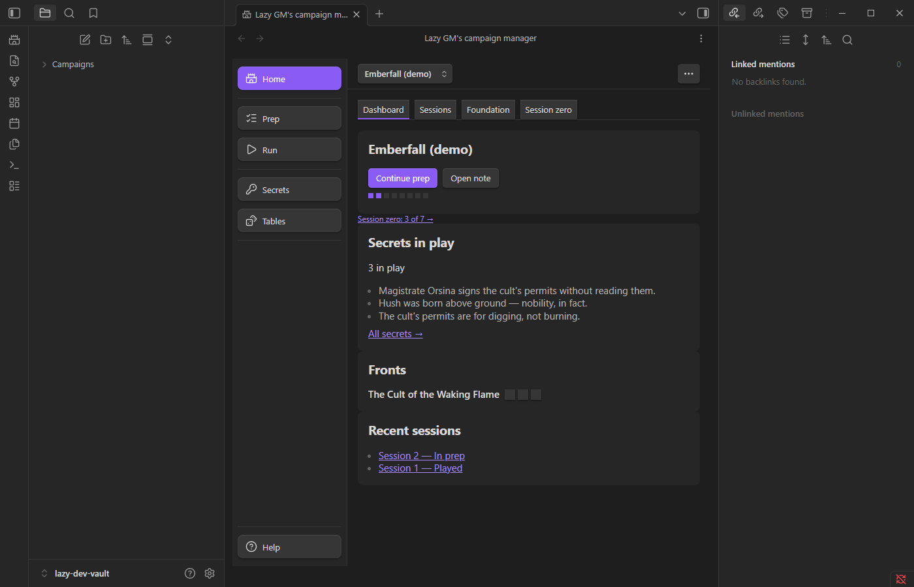
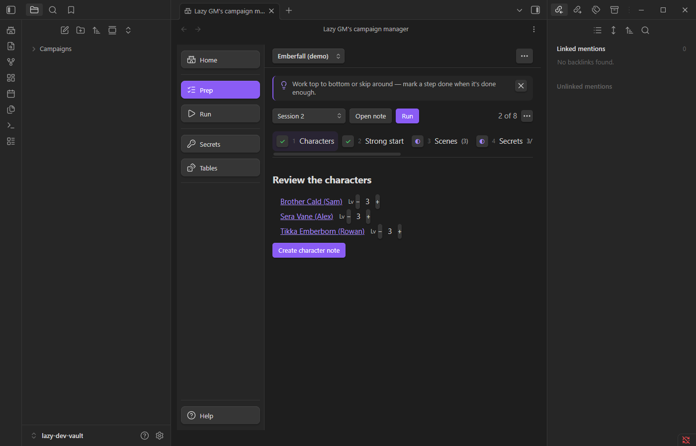
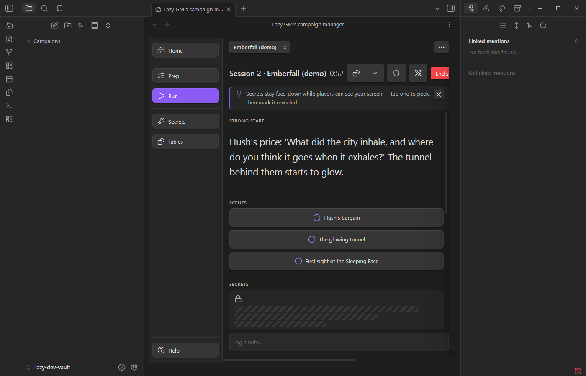
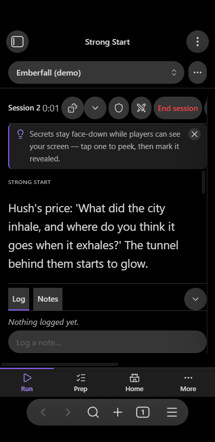

# Strong Start

Create and run TTRPG campaigns in Obsidian with the eight steps of lazy RPG prep, secrets that carry forward between sessions, and rollable random tables.

Built on the method from [Return of the Lazy Dungeon Master](https://slyflourish.com/lazydm/): a guided eight-step session prep board, a campaign dashboard, a distraction-free run mode for the table, built-in random tables and generators, user-authored custom tables, and an optional 5e improvisation module.

Everything the plugin creates is a plain markdown note in your vault — campaigns, sessions, NPCs, locations, quests, and tables stay yours, linkable and editable like any other note. The plugin's views are a lens over those notes, never a lock-in.

## The weekly loop

1. **Create a campaign** — a guided wizard for the pitch, six truths, and a front or two, with inspiration rolls at every field. Fifteen minutes and you're ready for session zero.
2. **Prep a session** — the eight-step worksheet: characters, strong start, scenes, secrets & clues, locations, NPCs, monsters, rewards. A quiet timer keeps you honest; under thirty minutes earns you a compliment.
3. **Run it** — big type, tap-to-strike scenes, face-down secrets that peek before they reveal, a one-tap d20, safety tools, and a log bar as the only writing surface.
4. **End the session** — tallies and a recap, then unrevealed secrets carry forward to the next session automatically.

## Features

- **Eight-step prep board** — master/detail worksheet with per-step "inspire me" rolls. Rolls never auto-insert; you stay the author.
- **Secrets & clues that carry forward** — unrevealed secrets flow into the next session; a ledger tracks what's in play, revealed, or retired across the whole campaign.
- **Run mode** — read-optimized and players-glancing-safe. Secrets stay masked until you peek and reveal them.
- **Built-in tables & generators** — strong starts, secrets, NPCs, treasure, traps, monuments, town events, dungeon monsters, and more from the Lazy GM's Resource Document, plus NPC/treasure/trap/monument/quest generators with per-line rerolls.
- **Custom tables** — any note with a bullet list or die-range table becomes rollable; a custom table with a built-in's id replaces that built-in.
- **Session zero & safety tools** — interactive checklist, lines & veils that surface in run mode's safety card.
- **Player-facing exports** — copy a campaign recap that mechanically filters unrevealed secrets, a session-zero player guide, or a one-page session sheet.
- **Starter campaign** — one command builds the document's own village of Whitesparrow and "The Night Blade" adventure as a ready-to-run campaign: eight NPCs, five locations, a quest, and session 1 fully prepped.
- **5e module** (toggleable) — encounter benchmark, improvised DCs/damage, monster difficulty dials, wilderness travel reference, stress-effect rules and tables.
- **Monster builder** (5e module) — build a custom monster from the Lazy GM's per-CR statistics table (or seven general-use stat blocks), customize attacks, roles, and features with a live preview, and save it as a campaign note; boss/minion pairings and monsters-by-location reference tables included.
- **Lazy Solo 5e** (toggleable) — the document's solo-play oracle tables and procedure.
- **Phone-ready** — bottom tab bar, drill-down prep, and a run mode built for the phone at the table.

## Getting started

1. Enable the plugin, then open it from the ribbon (castle icon) or the "Open view" command.
2. Run the **Create starter campaign** command for a ready-to-run adventure (the CC-BY village of Whitesparrow — add your party and run session 1 tonight), or **Create demo campaign** to explore a mid-campaign example with carried secrets. Delete their folders when done.
3. Create your own campaign from the dashboard and prep session 1.

## Install

Not yet in the community plugin store. Until then:

- **BRAT**: add this repository in [BRAT](https://github.com/TfTHacker/obsidian42-brat) as a beta plugin.
- **Manual**: copy `main.js`, `manifest.json`, and `styles.css` from a release into `<vault>/.obsidian/plugins/strong-start/`, then enable it in Community plugins.

## Data & privacy

- Every entity is a markdown note under one `lazyCampaign` frontmatter key — see [SCHEMA.md](SCHEMA.md) for the full, frozen contract.
- Secrets are stored as plain YAML in session notes: **the vault is the GM's screen**. Share player-safe material with the recap/guide exports instead of sharing the vault.
- The plugin makes no network calls, requires no account, and has no payment gate.
- Works on desktop and mobile.

## Attribution

This plugin includes content from the [Lazy GM's Resource Document](https://slyflourish.com/lazy_gm_resource_document.html) by Michael E. Shea of [SlyFlourish.com](https://slyflourish.com), released under the [Creative Commons Attribution 4.0 International License](https://creativecommons.org/licenses/by/4.0/). Portions of that document are derived from the System Reference Document 5.1 by Wizards of the Coast LLC, also licensed under CC-BY 4.0.

The 5e module's monster builder includes material taken from the [Lazy GM's 5e Monster Builder Resource Document](https://slyflourish.com/lazy_5e_monster_building_resource_document.html) written by Teos Abadía of [Alphastream.org](https://alphastream.org), Scott Fitzgerald Gray of [Insaneangel.com](https://insaneangel.com), and Michael E. Shea of [SlyFlourish.com](https://slyflourish.com), available under a [Creative Commons Attribution 4.0 International License](http://creativecommons.org/licenses/by/4.0/). That document likewise includes material from the SRD 5.1 (CC-BY 4.0).

## License

MIT — see [LICENSE](LICENSE). Embedded Lazy GM's Resource Document content remains CC-BY 4.0 as noted above.
